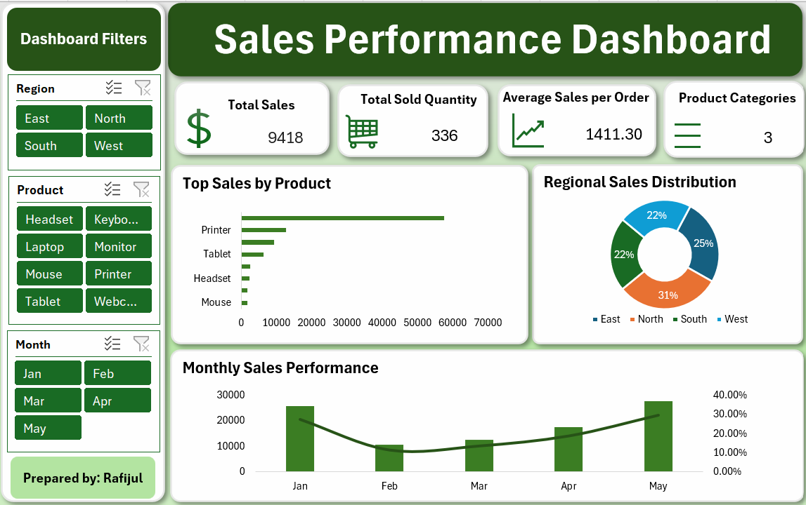

# Sales Performance Dashboard | Microsoft Excel

An interactive **Sales Performance Dashboard built entirely in Microsoft Excel** to analyze sales performance across products, regions, and months.

## 📊 Dashboard Overview

This dashboard provides a visual summary of key sales metrics and allows users to interactively explore the data using filters and slicers.

### Key Metrics

* **Total Sales:** 9,418
* **Total Sold Quantity:** 336
* **Average Sales per Order:** 1,411.30
* **Product Categories:** 3

### Dashboard Visualizations

* **Top Sales by Product** — compares sales performance across products
* **Regional Sales Distribution** — shows the percentage contribution of each region
* **Monthly Sales Performance** — tracks sales trends across months
* **Interactive Filters** — allows users to filter the dashboard by:

  * Region
  * Product
  * Month

## 🛠️ Tools & Excel Features Used

* Microsoft Excel
* Pivot Tables
* Pivot Charts
* Slicers
* KPI Cards
* Data Visualization
* Dashboard Design
* Excel Formulas
* Data Analysis

## 🎯 Project Objective

The goal of this project was to transform sales data into an interactive and easy-to-understand dashboard that can help users quickly identify sales trends, compare regional performance, and analyze product performance.

## 💡 Key Learnings

Through this project, I practiced:

* Organizing and analyzing structured data
* Creating interactive Pivot Table-based dashboards
* Building KPI cards for important business metrics
* Using slicers for interactive filtering
* Selecting appropriate charts for different types of analysis
* Designing a professional and user-friendly dashboard

## 📁 Project Files

* `Sales Performance Dashboard.xlsx` — Excel dashboard
* `sales-performance-dashboard.png` — Dashboard preview

## 🚀 Future Improvements

I plan to continue improving this project by exploring more advanced data analytics techniques and tools such as **Power BI, SQL, and Python**.

---

### 👤 Author

**Rafijul**

Aspiring Data Analyst | Excel | Power BI | SQL | Data Visualization
